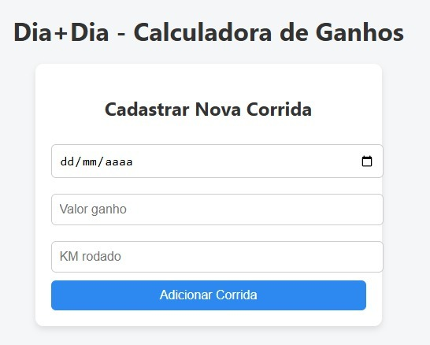
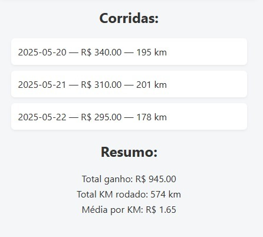

# 🚗 Dashboard para Motoristas de Aplicativo

Aplicativo desenvolvido para ajudar motoristas a gerenciar seus ganhos, custos e lucros mensais, com interface simples e intuitiva.

---

## 🔧 Tecnologias utilizadas

- React.js (com Vite)
- JavaScript (ES6+)
- HTML5 e CSS3
- LocalStorage (armazenamento local)
- Figma (prototipação de UI)

---

## 📷 Capturas de tela

### 💰 Tela de Cadastro de Ganhos


### 📉 Tela de Relatórios


---

## 💡 Resumo

Essa aplicação foi desenvolvida para auxiliar Motoristas de Aplicativo a organizarem-se financeiramente, priorizando a simplicidade e facilidade de uso, sem deixar para trás um design atual.

---
## 🚀 Como rodar o projeto

```bash
# Clone o repositório
git clone https://github.com/GuilhermeG08/calculadora-motoristas

# Acesse a pasta
cd drivecalc

# Instale as dependências
npm install

# Rode o projeto
npm run dev
